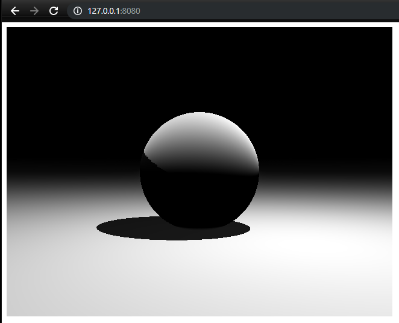

#  `RustWasmTracer`

A simple project to play with ray marching in rust, exposed via WebAssembly.

Based off [wasm-pack-template](https://github.com/rustwasm/wasm-pack-template), using [`wasm-pack`](https://github.com/rustwasm/wasm-pack).



## 🚴 Usage

### 🛠️ Build with `wasm-pack build`

```
wasm-pack build
```

### 🎁 Publish to NPM with `wasm-pack publish`

```
wasm-pack publish
```

### Run via npm

To generate our Rust-compiled to wasm code, in the root directory we run:

```
npm run build
```
This will create our bundled JavaScript module in a new directory dist.

We should be ready to run our project now! In the root directory, we'll run:

```
npm start
```

Then in a web browser navigate to `http://localhost:8080`.